# E-Commerce Backend ("e-commerce-backend")

REPO: https://github.com/smoyamendez/e-commerce-backend

HEROKU: https://thawing-thicket-39781.herokuapp.com/

## Table of Contents
  ---
* [Description](#description)
* [User Story](#user-story)
* [Requirements](#requirements)
* [Installation](#installation)
* [Usage](#usage)
* [Contributing](#contributing)
* [Questions](#questions)

## Description
---
A e-commerce backend using Express.js API, MySQL, and Sequelize.

## User Story
---
```md
AS A manager at an internet retail company
I WANT a back end for my e-commerce website that uses the latest technologies
SO THAT my company can compete with other e-commerce companies
```

## Requirements
---
```md
GIVEN a functional Express.js API
WHEN I add my database name, MySQL username, and MySQL password to an environment variable file
THEN I am able to connect to a database using Sequelize
WHEN I enter schema and seed commands
THEN a development database is created and is seeded with test data
WHEN I enter the command to invoke the application
THEN my server is started and the Sequelize models are synced to the MySQL database
WHEN I open API GET routes in Insomnia Core for categories, products, or tags
THEN the data for each of these routes is displayed in a formatted JSON
WHEN I test API POST, PUT, and DELETE routes in Insomnia Core
THEN I am able to successfully create, update, and delete data in my database
```

## Installation 
---
Make sure you have node js installed. Here is the link if needed: https://nodejs.org/en/download/ You can then fork this repo so you have a copy of your own to generate your team. After you have forked this repo and have a copy of it locally, in your terminal, change directories into the location you saved it in. Run npm install to install the package. See [Usage](#usage) after these steps are complete.

## Usage
---
Here is a video walk through of the user experience:

1. Run schema by copy/pasting into MYSQL Workbench, using the MYSQL Visual Studio Code Extension, or creating through MYSQL Shell.

Via my SQL Shell
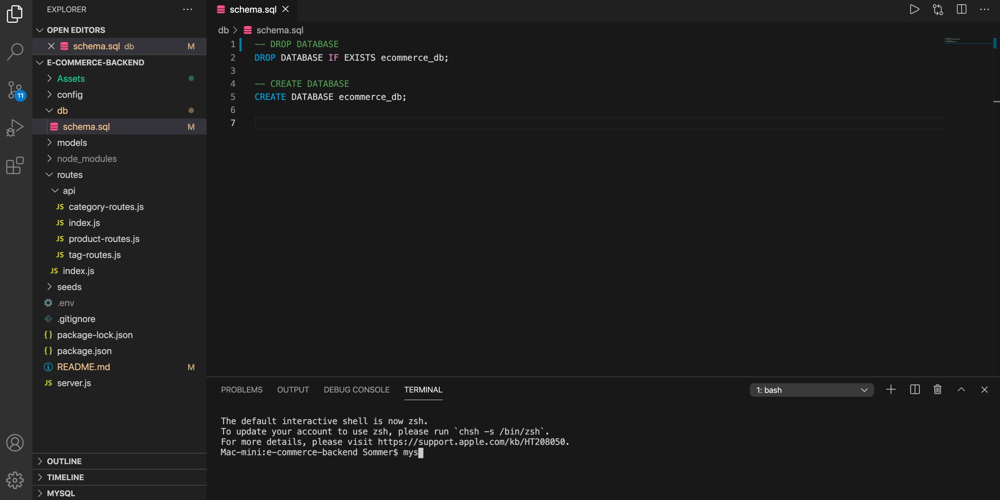

Via MYSQL VSC Ext
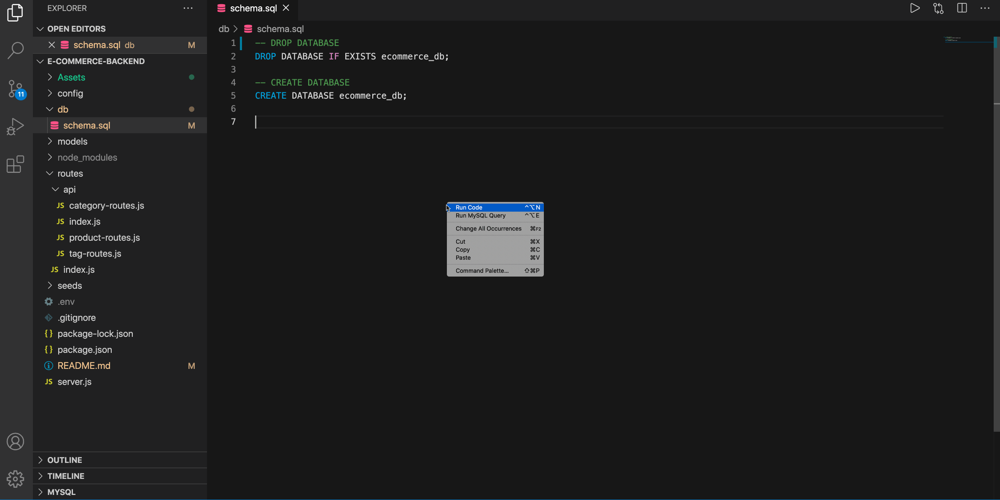

Via Workbench
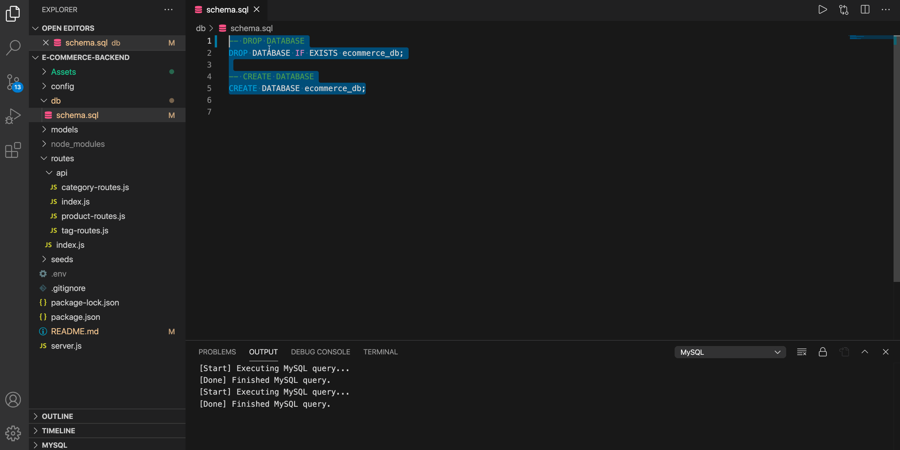

2. Seed your database by running "npm seed" in the terminal.

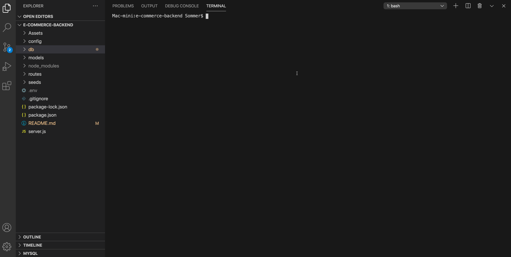

3. After your seed data is in place, you can start the server by running "npm start" in the terminal.

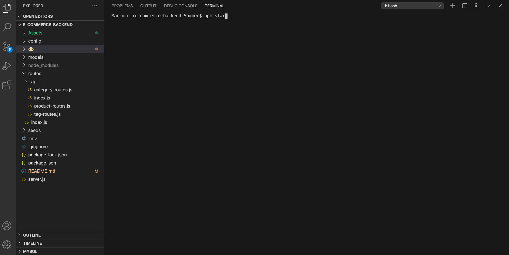

4. You can now use the GET command in an API testing program like Postman to get Categories, Products and Tag data in JSON format.

Get all Categories & Categories by ID
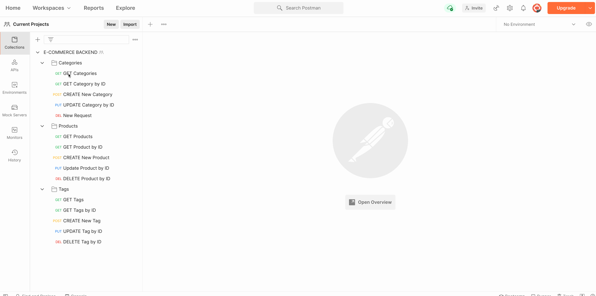

Get all Products & Products by ID
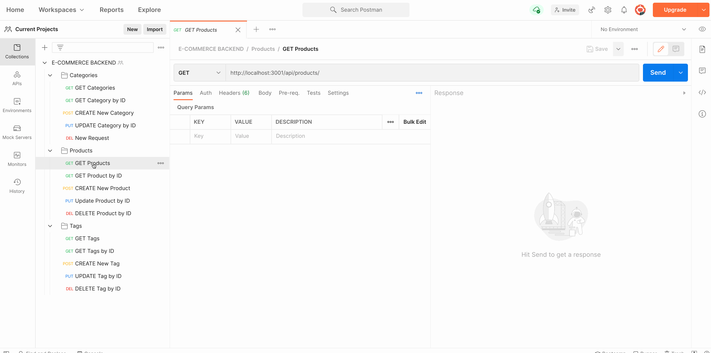

Get all Tags & Tags by ID
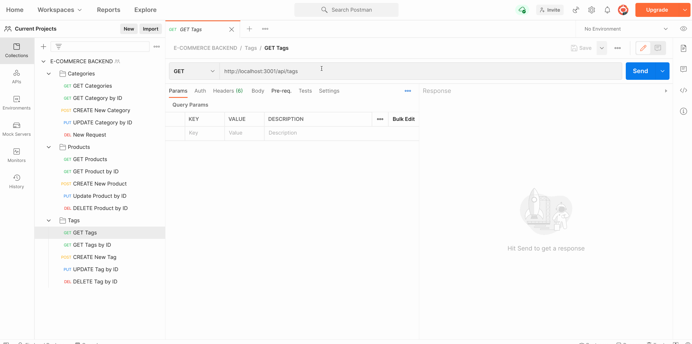

5. You can also use POST, PUT, and DELETE commands in Postman to create, update or delete your Categories, Products and Tags.

POST, PUT & DELETE in Categories
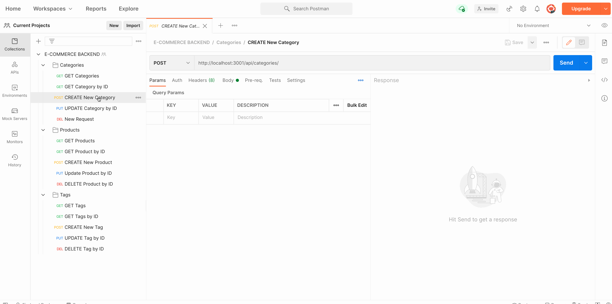

POST, PUT & DELETE in Products
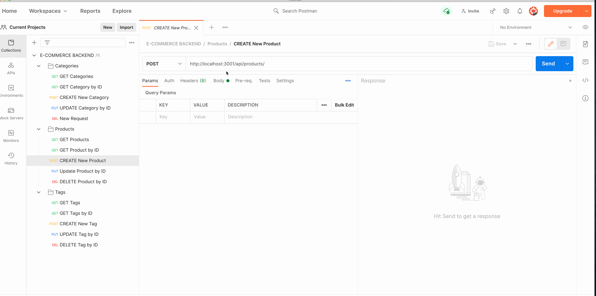

POST, PUT & DELETE in Tags
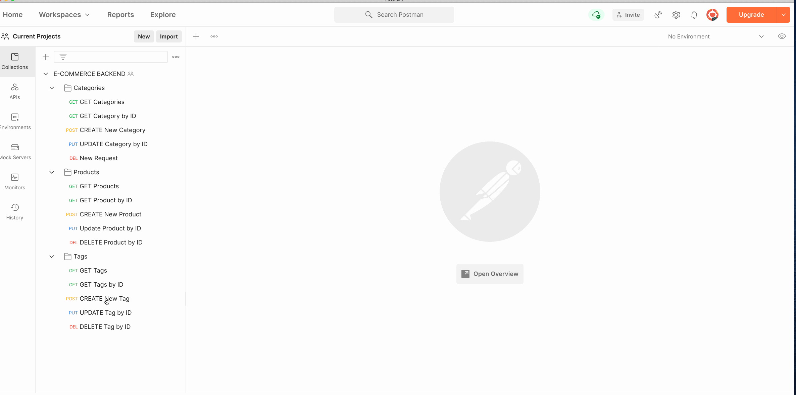

## Contributing
---
Author: Sommer Moya-Mendez [(smoyamendez)](https://github.com/smoyamendez)

Starter code provided by Trilogy Education.

## Questions
---

[GitHub](https://github.com/smoyamendez)

If you have any questions, please email me at: smoyamendez@gmail.com